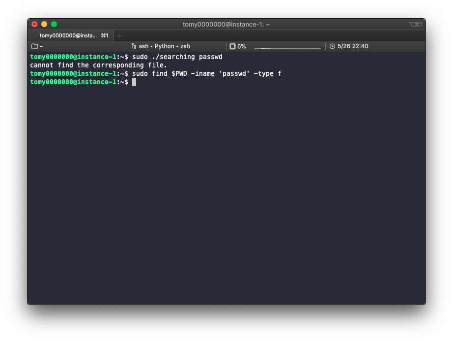
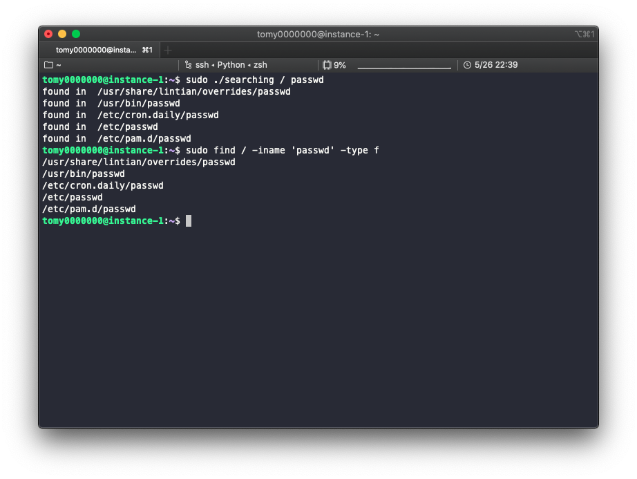

# Homework 4

> *Searching a file*

* Implement a simple version of unix `find` command

## Usage

* Search in current directory

```bash
./searhcing [target_file]
```



* Search in specific directory

```bash
./searching [location] [target_file]
```

